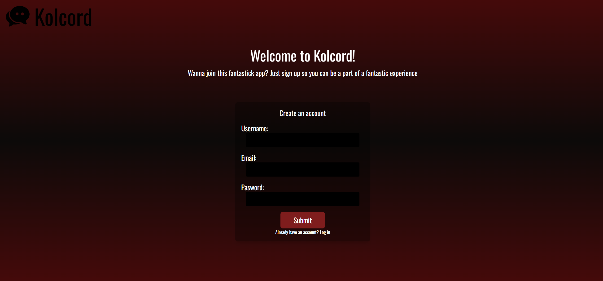
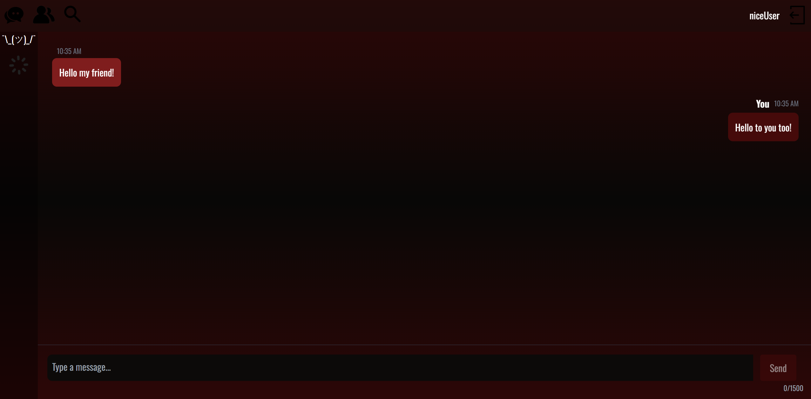

# Kolcord





**Kolcord** is a modern chat application designed to connect people meaningfully. Built with cutting-edge technologies, it provides a seamless experience for users to find friends, chat, and build connections. The app features a C# ASP.NET backend, an Entity Framework-powered database, and a React-based frontend.

## Features

- **User Profiles**: Create profile to connect with your friends.
- **Real-Time Chat**: Instant messaging with your connections.
- **Secure Authentication**: Login with secure credential handling.
- **Scalable Infrastructure**: Robust architecture for handling a growing user base.

---

## Future Features

- **Voice Calls**
- **Video Calls**
- **Group Calls**
- **Group Chats**
- **Communities**

---

## Tech Stack

- [](https://dotnet.microsoft.com/)
- [](https://learn.microsoft.com/en-us/ef/)
- [](https://www.typescriptlang.org/)
- [](https://reactjs.org/)
- [](https://tailwindcss.com/)
- [](https://learn.microsoft.com/en-us/aspnet/core/security/authentication/)
- [](https://learn.microsoft.com/en-us/aspnet/core/signalr/introduction)
- [](https://nodejs.org/)
- [](https://www.npmjs.com/)
- [](https://www.postgresql.org/)
- [](https://dotnet.microsoft.com/en-us/download)
- [](https://www.docker.com/)

### Backend

- **ASP.NET Core**
  - API development
  - Business logic implementation
- **Entity Framework**
  - Database ORM
  - Supports migrations and queries
  - Database compatibility

### Frontend

- **Typescript/React**
  - Dynamic, responsive user interface
  - Component-based design for maintainability
  - Styled with Tailwind CSS

### Additional Technologies

- **Authentication**: Identity Framework
- **Real-Time Communication**: SignalR for chat
- **Node.js** and **npm**

---

## Installation

### Prerequisites

- .NET SDK installed
- Node.js installed
- SQL Server or your chosen database system
- IDEs: Visual Studio, JetBrains Rider

### Application Setup with Docker

1. **Clone the repository**:
   ```bash
   git clone https://github.com/kristofNyikes/kolcord.git
   cd kolcordApp
   ```
2. **Docker setup**:

- Create a .env.docker file with the following content:

  ```bash
  VITE_BASE_URL=http://localhost:8080
  ```

- Run the docker-compose.yml file in `/kolcordApp` in the terminal with the `docker compose up --build` command to create the application in Docker.
- Docker compose runs the entire server, frontend and database.

3. **Access the app**:
   Open your browser and navigate to `http://localhost:5173`.

### Native Application Setup

1. **Clone the repository**:

   ```bash
   git clone https://github.com/kristofNyikes/kolcord.git
   cd kolcordApp
   ```

2. **Backend setup**:

- Navigate to the backend folder:
  ```bash
  cd kolcordWebApi/
  ```
- Restore dependencies:
  ```bash
  dotnet restore
  ```
- Set up the database connection string in `appsettings.json`.
- Run migrations:
  ```bash
  dotnet ef database update
  ```
- Start the server:
  ```bash
  dotnet run
  ```

3. **Frontend setup**:

- Navigate to the frontend folder:
  ```bash
   cd kolcordReactApp/
  ```
- Install dependencies:
  ```bash
  npm install
  ```
- Create .env file:
  ```bash
  VITE_BASE_URL=http://localhost:8080
  ```
- Start the React development server:
  ```bash
  npm run dev
  ```

4. **Access the app**:
   Open your browser and navigate to `http://localhost:5173/`.

---

## Environment Variables

### Backend

- `ConnectionStrings__DefaultConnection`: PostgreSQL connection string

### Frontend

- `VITE_BASE_URL`: API base URL (use `http://localhost:8080` )

---

We welcome contributions! To contribute:

1. Fork the repository.
2. Create a feature branch:

   ```bash
   git checkout -b feature-name
   ```

3. Commit your changes and push the branch.
4. Submit a pull request.
